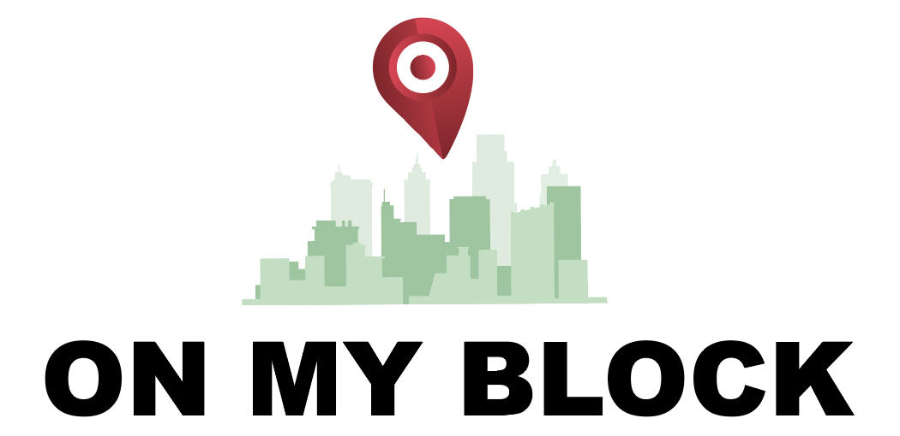
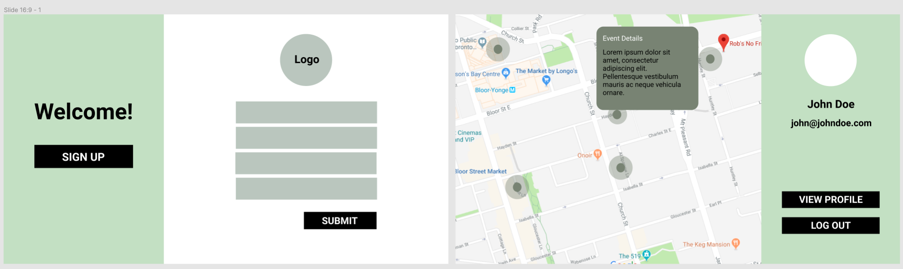
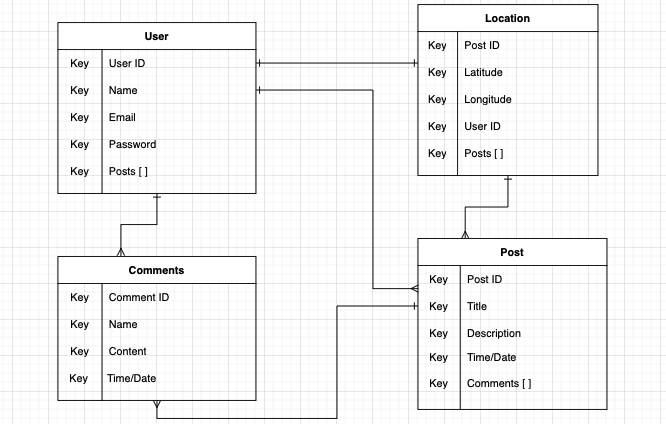
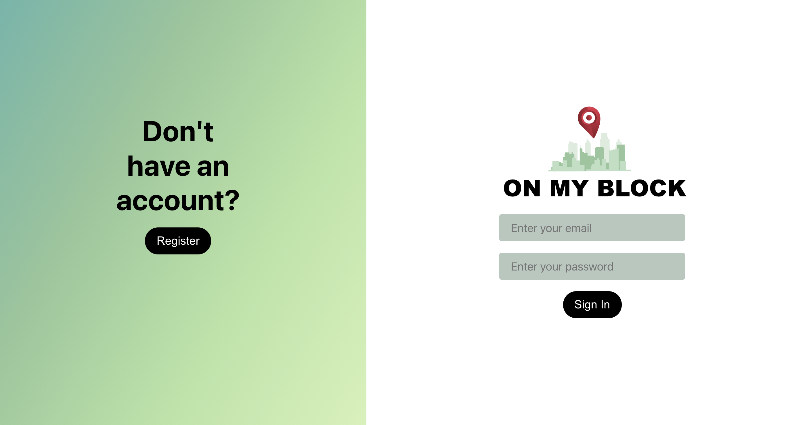
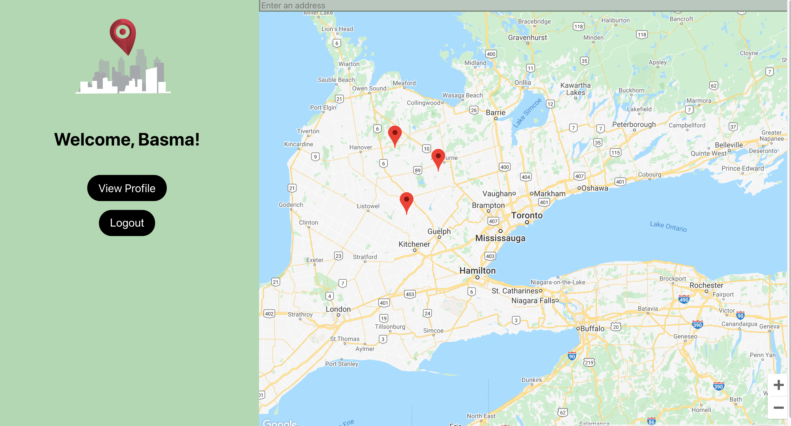
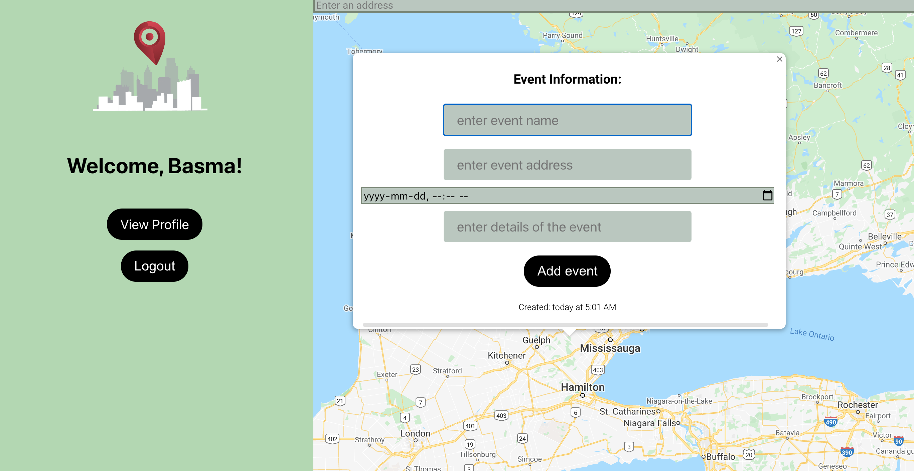

# On My Block

## Introduction:

Wondering if there's anything interesting happening on your block? From pop up restaurants to trade shows and expos, find out what events are being held around your city with On My Block! Not only that, if you're hosting an event of your own, you can create and display it for others to see and attend so you can get more attendance!

## Deployed App:
You can find the deployed app [here.](https://onmyblockrtw.herokuapp.com/)

## Collaborators:
- Basma Shahid
- RuiTing Wang
- Ida Ogieva
- Mohamed Abdulle

## Tools Used:
As we worked on our project, we used various tools to map out our features, track our progress, and stay organized as we worked towards creating On My Block.

### Figma Wireframe:
Here are some screenshots from the Figma wireframe:

### ERD:
This was our initial ERD: 

### Trello:
You can find the Trello board [here.](https://trello.com/b/uxz9MIqA/on-my-block)

## Screenshots:

## Technologies Used:
- HTML
- CSS
- JavaScript
- MongoDB
- Express
- React JS
- Node JS
- Google Maps API

## Planning for Future Enhancement:
* Allow users to click on an event and choose whether they want to attend the event or not.
* Add categories to events and let users search up different events based on a particular category.
* Let users view other users' profiles.
* Give users the ability to post comments on different events.
